# I. SQL và NoSQL
## 1. Cơ sở dữ liệu quan hệ(SQL) và cơ sở dữ liệu phi quan hệ (NoSQL)
- **Cơ sở dữ liệu quan hệ** là một cơ sở dữ liệu có cấu trúc sử dụng các bảng để lưu trữ dữ liệu. **Mỗi bảng lưu trữ một thực thể, với mỗi hàng chứa một thể hiện của thực thể đó.** Ví dụ: đối với bảng học viên, mỗi hàng sẽ xác định duy nhất một học viên và các cột khác nhau sẽ chỉ định các thuộc tính khác nhau về học sinh. Tất cả các cơ sở dữ liệu quan hệ **sử dụng SQL (Ngôn ngữ truy vấn có cấu trúc)** để tương tác với cơ sở dữ liệu.

    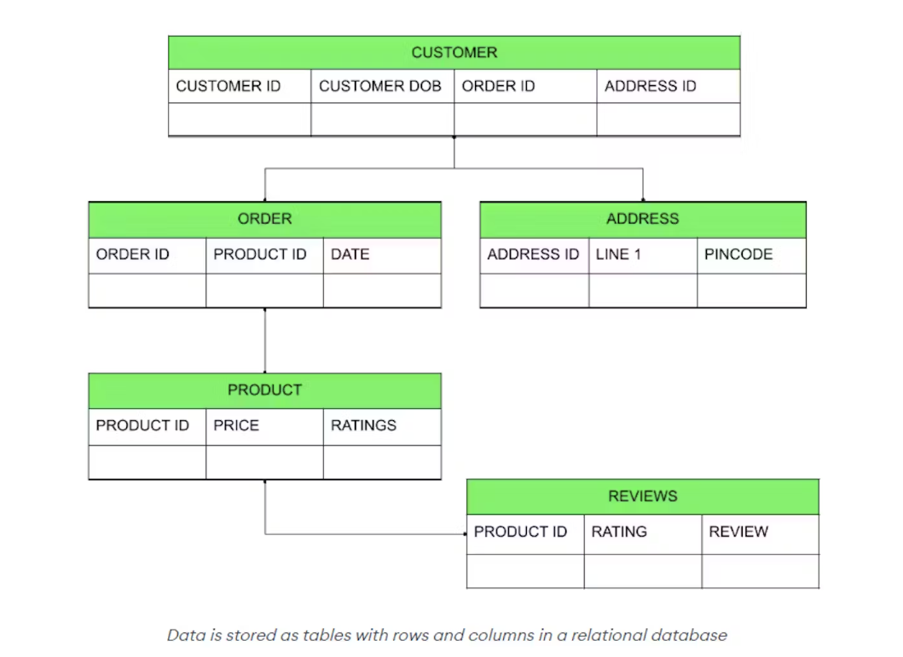
- **Cơ sở dữ liệu phi quan hệ(NoSQL)** là cơ sở dữ liệu không có cấu trúc cứng nhắc. Nó có thể lưu trữ dữ liệu dưới dạng **Key-Value, Document, Graph hoặc Wide-Column.** Do thiếu cấu trúc nghiêm ngặt, nó mang lại sự linh hoạt hơn và có thể lưu trữ nhiều loại dữ liệu phi cấu trúc. 
- Lưu trữ dạng key - value: Redis

    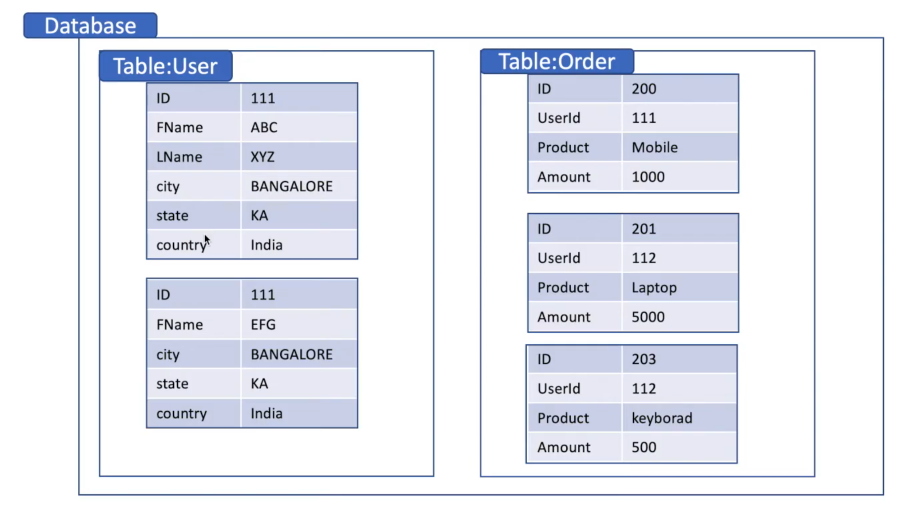

- Lưu trữ dạng document: dưới dạng json

    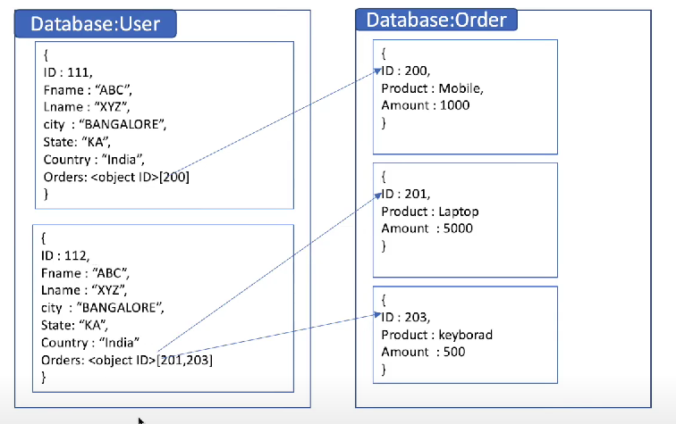

## 2. Sự khác nhau giữa SQL và NoSQL
### a. Lưu trữ cơ sở dữ liệu
- SQL lưu trữ dữ liệu trong các bảng chứa hàng và cột.
- NoSQL lưu trữ dữ liệu bằng nhiều phương pháp khác nhau tùy thuộc vào loại dữ liệu phi cấu trúc được nhập.

    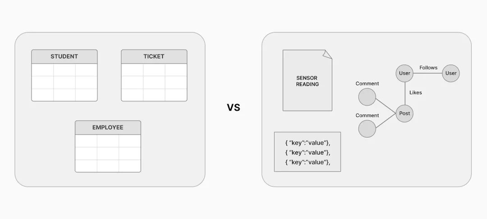
### b. Loại dữ liệu
- NoSQL có thể nhập, lưu trữ và truy xuất dữ liệu phi cấu trúc, cơ sở dữ liệu SQL.
- SQL cơ sở dữ liệu chỉ có thể nhập, lưu trữ và truy xuất dữ liệu có cấu trúc. 
### c. Lược đồ
- Cơ sở dữ liệu SQL dựa trên một lược đồ dữ liệu nghiêm ngặt, được xác định trước mà dữ liệu được nhập phải phù hợp.
- Ví dụ lược đồ quản lý thư viện:

    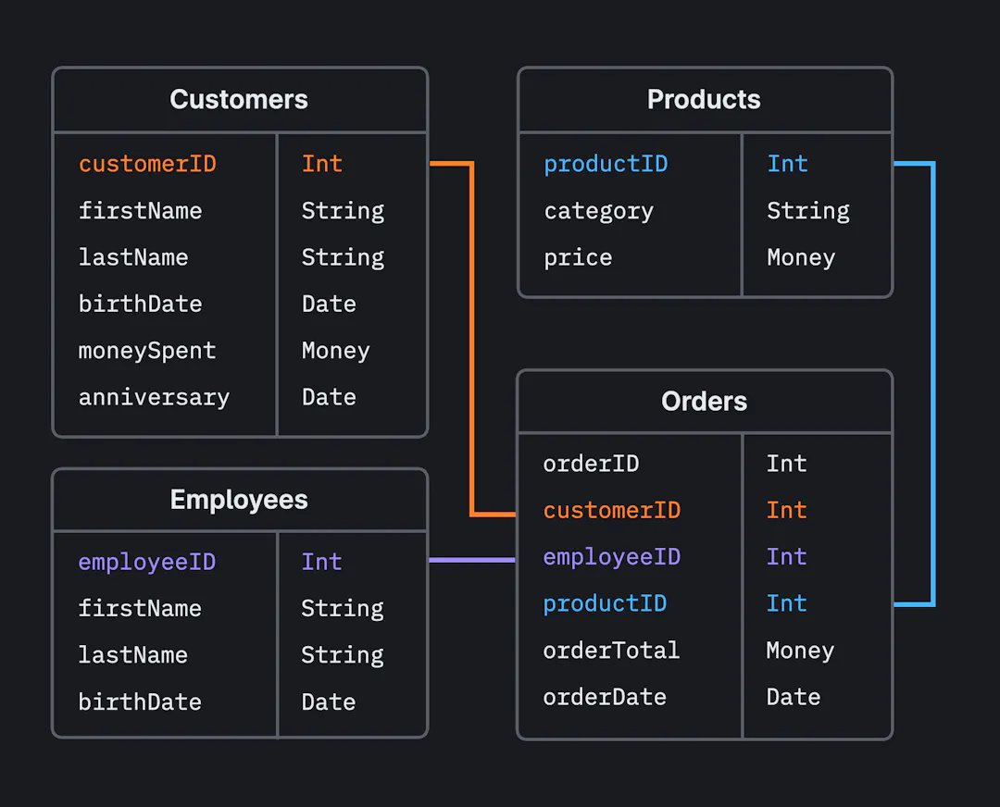

- NoSQL sử dụng các lược đồ linh hoạt cho phép chúng nhập dữ liệu ở các định dạng gốc khác nhau.
- Ví dụ lưu trữ theo phiên đăng nhập session, key - value

    

### d. Khả năng mở rộng
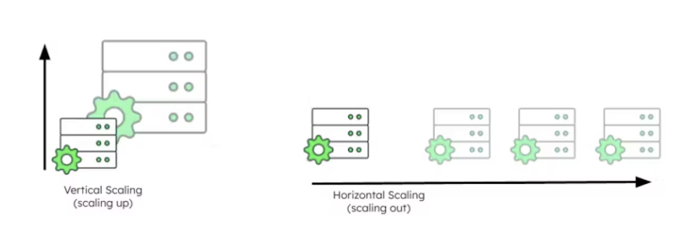
- SQL: **Vertical Scaling (Scaling Up):** Tăng sức mạnh của một máy chủ đơn lẻ bằng cách thêm tài nguyên như CPU, RAM hoặc dung lượng lưu trữ.
- NoSQL: **Horizontal Scaling (Scaling Out):** Thêm nhiều máy chủ hơn vào hệ thống để chia tải công việc. Nghĩa là một số máy tính độc lập (ví dụ: các nút) được liên kết thông qua mạng và làm việc cùng nhau để mang lại các mục tiêu chung.

## 3. Ưu, nhược điểm của SQL và NoSQL
### 3.1. SQL
#### a. Ưu điểm
- Hỗ trợ ACID (Atomicity(Nguyên tử), Consistency(Nhất quán), Isolation(Cô lập), Durability(Bền vững)), đảm bảo tính toàn vẹn và nhất quán của dữ liệu.
    - Atomicity(Nguyên tử): chuyển tiền thành công -> cập nhật, thất bại -> hoàn tác
    - Consistency(Nhất quán): Đảm bảo hợp lệ, số dư âm không đc phép.
    - Isolation(Độc lập): Hai giao dịch không ảnh hưởng lẫn nhau.
    - Durability(Bền vững): Sau mỗi giao dịch thì số dư cập nhật chính xác.

- Truy vấn dữ liệu dễ dàng và linh hoạt với ngôn ngữ truy vấn SQL chuẩn.

#### b. Nhược điểm: 
- Hạn chế trong việc mở rộng quy mô lớn và xử lý dữ liệu phi cấu trúc. Vì SQL mở rộng theo hướng Vertical Scaling, môt máy chủ duy nhất, khi dữ liệu to thì việc mở rộng, lấy khó khăn.
- Khó khăn trong việc thay đổi cấu trúc dữ liệu khi ứng dụng phát triển.
### 3.2. NoSQL
#### a. Ưu điểm
- Hỗ trợ quy mô lớn và dễ dàng mở rộng hệ thống(Horizontal Scaling).
- Được thiết kế để xử lý dữ liệu phi cấu trúc và linh hoạt trong việc thay đổi cấu trúc dữ liệu.
    - Ví dụ: đối tượng A gồm thuộc tính x, y, z. Khi cần thay đổi thuộc tính thì không cần thêm cột như SQL.
- Hiệu suất cao khi truy vấn dữ liệu lớn và phức tạp.
    - Ví dụ: Cassandra theo hình thức phân vùng. Nó bao gồm các cụm, mỗi cụm gồm các nút chịu trách nhiệm lưu trữ khác nhau. Khi request gửi vào, được gắn vào một khóa vùng, sau đó nó sẽ được điều phối đến nút để truy suất dữ liệu.
#### b. Nhược điểm
- Không hỗ trợ đầy đủ các tính năng ACID, có thể dẫn đến sự mất mát dữ liệu trong một số tình huống
- Cú pháp truy vấn và tương tác với dữ liệu phức tạp hơn so với SQL.

# II. MySQL với MongoDB
## 1. MongDB
### 1.1. Các thuật ngữ trong MongoDB
- Các thuật ngữ trong cơ sở dữ liệu quan hệ tương ứng với trong MongoDB

    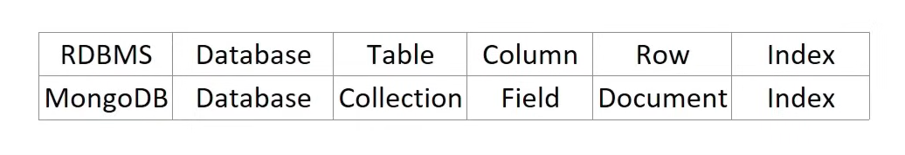
- Ví dụ việc ánh xạ dữ liệu từ bảng sang document trong mongoDB

    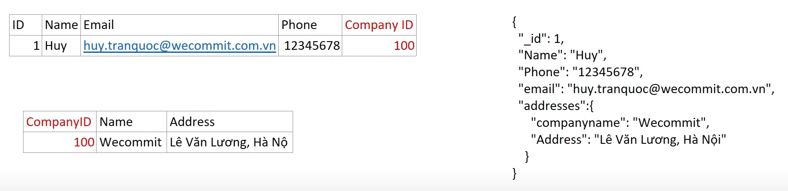

### 1.2. Các mô hình triển khai trong MongoDB
- **Mô hình Standalone:** 
    - Một server duy nhất, đọc và ghi vào trong db đó, dễ dàng triển khai.
    - Vấn đề sẵn sàng, khi server có vấn đề thì không có gì để backup, đọc ghi liên tục trên 1 server sẽ ảnh hưởng hiệu năng.

        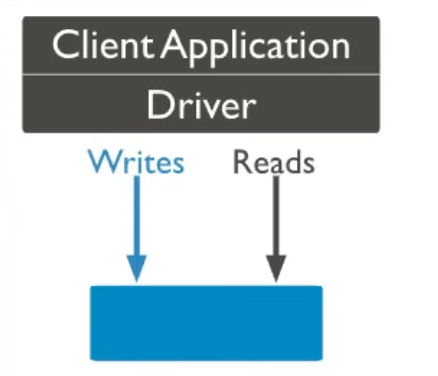

- **Mô hình Replication:**
    - Một server sẽ chịu trách nhiệm đọc và ghi, chỉnh sửa dữ liệu. Sau khi cập nhật dữ liệu thì server chính đẩy dữ liệu cho sv phụ, nhiệm vụ sv phụ là cập nhật dữ liệu
    -> Lỡ sv chính lỗi thì đẩy lên sv phụ lên làm chính.
    -> vẫn có vấn đề hiệu năng vì có 1 sv đọc, ghi dữ liệu

    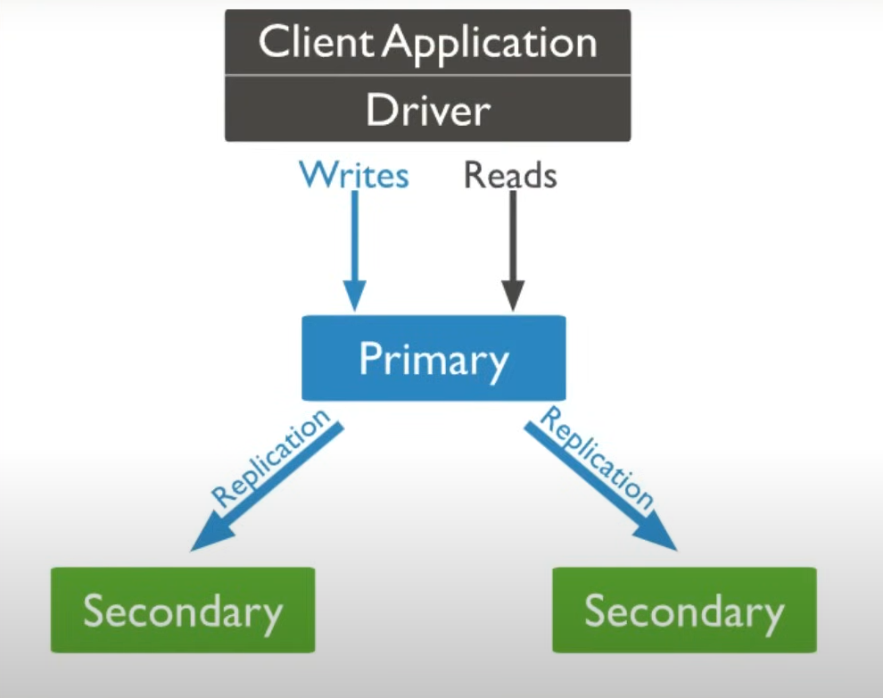

- **Mô hình Sharding:**
    - Chia dữ liệu thành nhiều server: Ví dụ lưu dữ liệu ở các tỉnh khác nhau thì mỗi tỉnh sẽ đặt một vài sv để lữu trữ dữ liệu
    -> dễ dàng mở rộng
    -> Dữ liệu ít thì đọc và ghi sẽ dễ dàng hơn. Mỗi máy chủ lại theo mô hình Replication.
    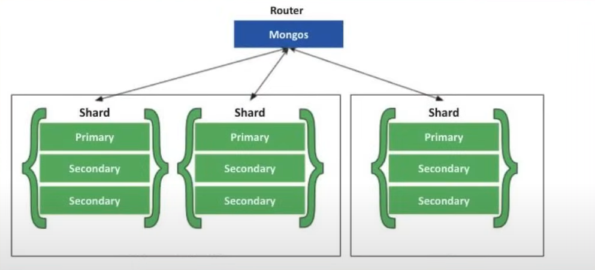

### 1.3. Kiến trúc MongoDB
- Kiến trúc về mặt logic:
    - Một db có nhiều collections, mỗi col lại có nhiều doc, giống như một csdl quan hệ thì có nhiều bảng -> mỗi bảng có nhiều bản thi.

    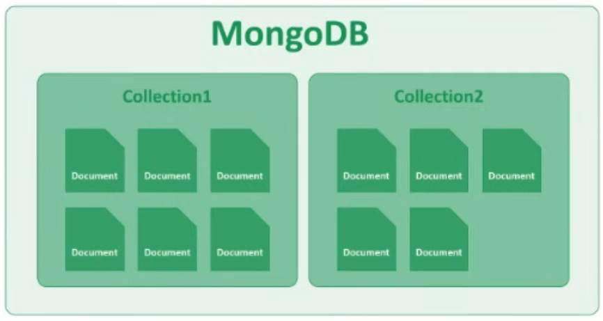
- **Kiến trúc hoạt động**
    - Trong kiến trúc server thì có một vùng bộ nhớ được cấp phát, trong đó 1 vùng bộ nhớ của db.
    - Ngoài ra nó sẽ gồm tập các file(Như ổ cứng trong máy tính -> tắt máy thì vẫn còn)
    - Khi người dùng gửi yêu cầu lên db thì db sẽ lấy dữ liệu từ file lên db memory để sử dụng.
    Trong đó có **Storage engine** chịu trách nhiệm lưu trữ, quản lý và truy cập dữ liệu trên đĩa cứng hoặc bộ nhớ.

    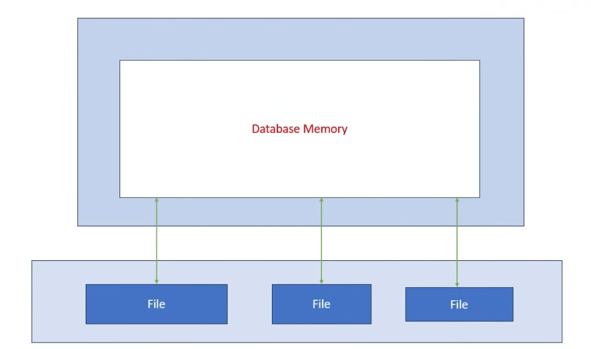
- **Storage engine**
    - Chịu trách nhiệm lưu trữ, quản lý và truy cập dữ liệu trên đĩa cứng hoặc bộ nhớ. Ví dụ như MMAPv1, WiredTiger, In-Memory.
    - Trong đó WiredTiger sử dụng nhiều phù hợp với đa dạng loại ứng dụng

    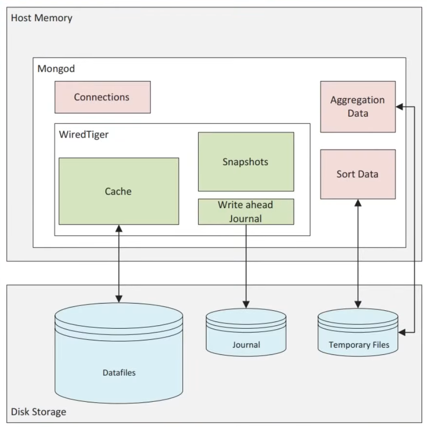
    - Cache chứa dữ liệu để xử lý.
    - Thêm dữ liệu, cập nhật đẩy vào write ahead journal sau đó đẩy xuống journal để lưu trữ dữ liệu.
    - Snapshots: đảm bảo nhất quán khi có nhiều thao tác.

### 1.4. Thao tác trên MongoDB
#### a. Database
- Show db
    ```sql
    show databases
    ```
- Sử dụng/ thêm 1 db
    ```sql
    use <name db>
    ```
- drop collection:

    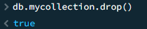
#### b. Create
- **InsertOne**
    - Thêm 1 doc
        ```sql
        db.mycollection.insertOne({
            name: "Minh",
            age: 25,
            city: "NA"
        })
        ```
        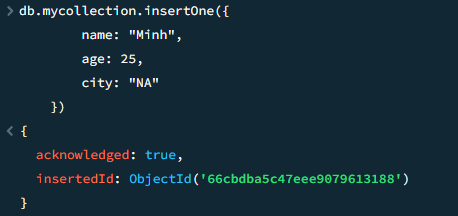
    
    -> Tự tạo index
- **InserMany**
    - Thêm nhiều docs
        ```sql
        db.mycollection.insertMany([
            {name: "Minh", age: 20, city: "NA"},
            {name: "Long", phone: "123456"}
        ])
        ```

        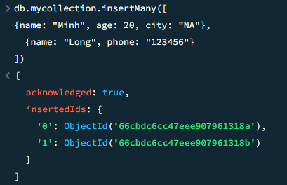
#### c. Read
- Xem toàn bộ document

    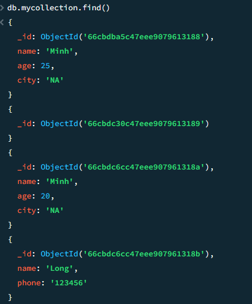
- Giới hạn bản ghi trả về
    
    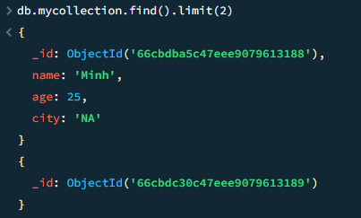
- Lọc điều kiện:

    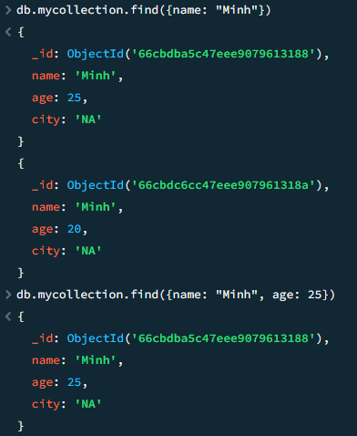
- Lọc theo nhiều điều kiện logic
    - And

        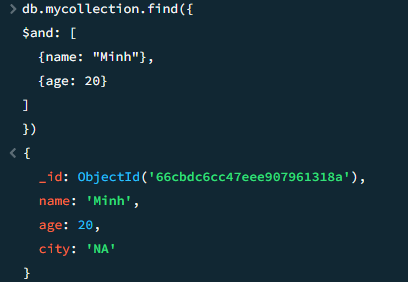
    - Or

        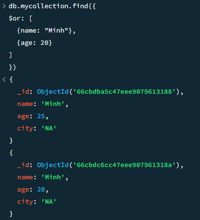
- Lọc theo phép so sánh
    - Lớn hơn: $gt(greater than)

        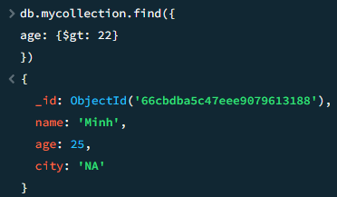
    - Nhỏ hơn: $lt(less than)

        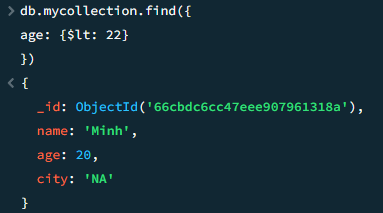
- Sắp xếp dữ liệu
    - Tăng dần: 1, giảm dần, -1

        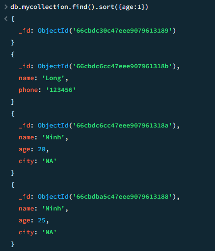
#### d. update
- updateOne: update bản ghi tìm kiếm đầu tiên

    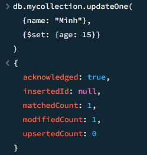
- updateMany: update tất cả bản ghi

    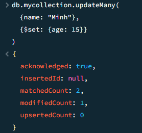
#### e. delete
- Xóa doc:

    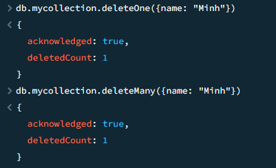
### 1.5 Tối ưu db bằng cách đánh index
#### a. Init dữ liệu
- Hàm gen

    ```sql
    function generate(){
        const nameGen = ["Minh", "Quang", "Vũ"];
        const ageGen = Math.floor(Math.random()*50) + 20;
        const emailGen = nameGen.toLowerCase() + "@example.com";
        const phoneNumberGen = "123434546"
        return{
            name: nameGen,
            age: ageGen,
            email: emailGen,
            phone_number: phoneNumberGen
        };
    }
    ```
    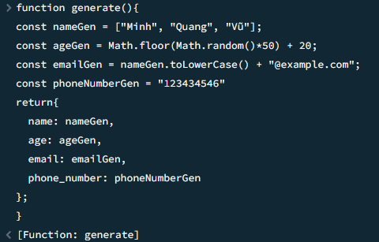
- Đẩy vào mảng
    ```sql
    const cus = []
        for (let i = 0;i<5000000;i++){
        cus.push(generate())
    }
    ```
    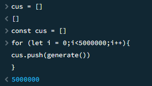
- Đẩy vào collections
    ```sql
        const batchSize = 100000
        for (let i = 0;i< cus.length;i+=batchSize){
            const batch = cus.slice(i, i+batchSize);
            db.mycollection.insertMany(batch)
        }
    ```
- Kiểm tra

    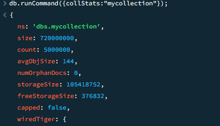
#### b. Tìm kiếm dữ liệu
- Tìm kiếm thông tin của một doc bất kì
    ```sql
        db.mycollection.find({name: "Minh", age: 20}).explain("executionStats")
    ```
    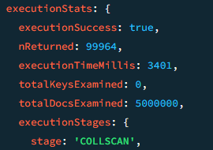
- Đánh index vào 1 trường và tìm kiếm
    - Đánh index
        ```sql
        db.mycollection.createIndex(
            {age: 1},
            {name: "IDX_AGE"}
        );
        ```
        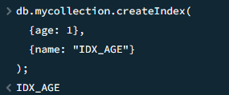
    - Lúc này tìm kiếm thông tin

        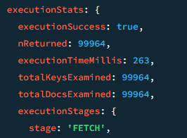
## 2. MySQL
### 2.1 Kiến trúc
- MYSQL Architecture gồm 3 layer chính bao gồm:
    - Application Layer
    - MySQL Server layer
    - Storage Engine Layer

    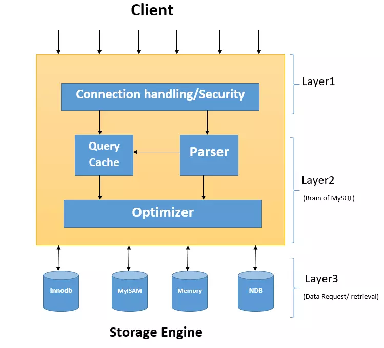
#### a. Application Layer
- Application Layer chính là lớp trên cùng nhất trong kiến trúc MySQL

    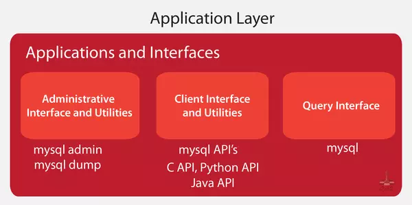
- **Administrators** sử dụng các tiện ích và giao diện quản trị khác nhau: Tắt máy, tạo, hủy, sao chép CSDL
- **Clients** giao tiếp với MySQL thông qua các giao diện và tiện ích khác nhau như MySQL API.
- **Query Users** truy vấn tương tác với MySQL RDBMS thông qua giao diện truy vấn là mysql .
- Để tầng cao nhất(Application Layer) kết nối phần bên dưới có các thành phần:
    - **Connection handling:** Khi một client kết nối với server, Client sẽ nhận được thread riêng cho kết nối của nó. Tất cả các truy vấn từ client đó được thực thi trong thread được chỉ định đó.
    - **Authentication:** Xác thực username, password, host

        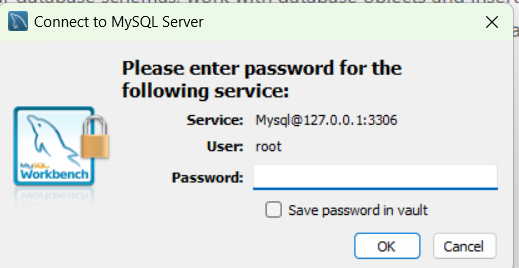
    - **Security:** MySQL đưa ra đặc quyền nhất định với mỗi client đó. Ví dụ admin,..
#### b. MySQL Server layer(Brain of MySQL)
- Lớp này đảm nhất tất cả các chức năng logic của hệ thống mysql RDBMS.
- Các thành phần của nó bao gồm:
    - **MySQL services and utilities:** Lớp này cung cấp các dịch vụ và tiện ích để quản trị và bảo trì hệ thống MySQL.
        - **Backup and recovery:** Sao lưu để khôi phục dữ liệu khi dữ liệu gặp sự cố.
        - **Security:** Dựa trên kiểm soát truy cập(ACL). Không được bất kì ai truy cập bảng user, chỉ cấp quyền cần thiết cho mỗi tài khoản, mất khẩu không đc lưu rõ ràng(hashPassword),...
        - **Replication:** Sao chép dữ liệu giúp backup server nếu có vấn đề
        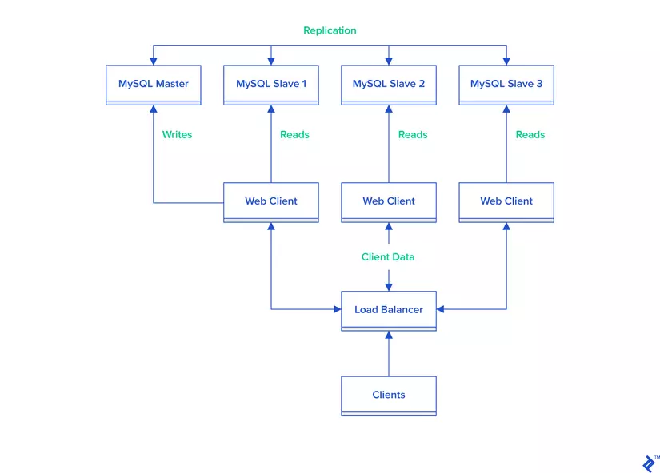
        - **Cluster:** Lưu trữ dữ liệu server chia thành các cụm, giúp việc mở rỗng dễ dàng hơn.
        - **Partitioning:** phân chia một table thành những phần nhỏ theo một logic nhất định, được phân biệt bằng key.
        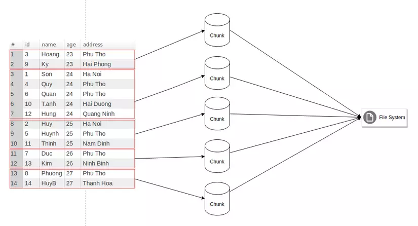
    - **SQL Interface:** Truy vấn dữ liệu
    - **Parser:** Khi nhận truy vấn thì nó sẽ phân tích cú pháp, để đưa ra luồng chạy của câu truy vấn(không giống như code sẽ chạy từ trên xuống dưới)
    - **Optimizer:** Áp dụng kỹ thuật tối ưu khác nhau viết lại truy vấn, thứ tự quét bảng,...
    - **Caches:** Bộ đệm truy vấn, máy chủ SQL khảo sát bộ đếm truy vấn, nếu có truy vấn giống hệt thì **bỏ qua bước Parser và Optimizer -> thực thi**
#### c. Storage Engine Layer
- MySQL cho phép chúng ta lựa chọn các công cụ lưu trữ khác nhau cho các tình huống và yêu cầu khác nhau.
- Ví dụ: 
    - **MyISAM:** Hỗ trợ truy vấn nhanh, nhưng không hỗ trợ giao dịch.
    - **Memory:** Lưu trữ dữ liệu trong bộ nhớ, phù hợp cho các dữ liệu tạm thời.
    - ...
### 2.2 Tối ưu bằng việc đặt select
- Select các bản ghi có tuổi bằng 20
    ```sql
    explain select * from user_management.mock_data
    where age = 20
    ```
    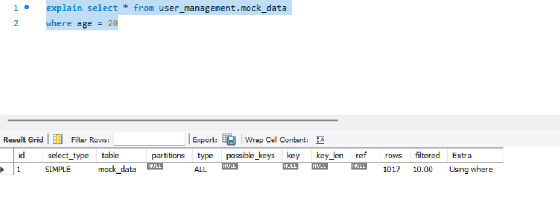
- Tạo index với tuổi
    ```sql
    create index idx_age on user_management.mock_data(age)
    ```
- Lúc này khi tìm kiếm bản ghi có tuổi bằng 20:
    
    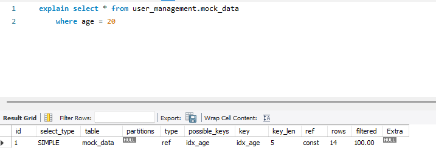
- Nên đặt index theo đúng thứ tự, không nên qua lạm dụng index
### 2.3 Buffer cache hit
- Khi một request gửi đến thì yêu cầu sẽ gửi server thì nó sẽ check trong bộ nhớ cache, nếu có thì nó sẽ thực thi luôn dẫn đến thời gian thực thi sẽ nhanh
- Để kiểm tra số request đã gửi đến server dùng:
    ```sql
    show global status like '%Innodb_buffer_pool_read_request%';
    ```
    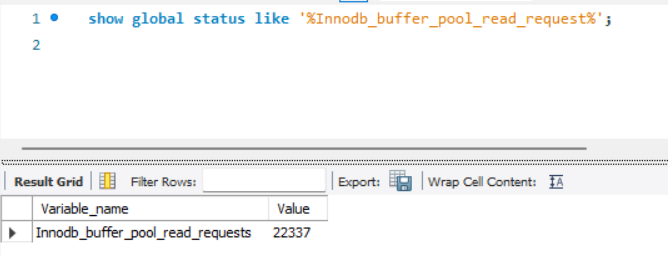
    
- Để kiểm tra số request mà server phải xuống bộ nhớ vật lý lấy dùng:
    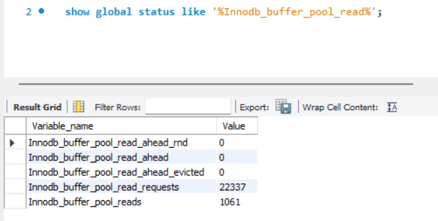

- Nếu tỉ lệ này < 90% thì cần phải tối ưu lại
