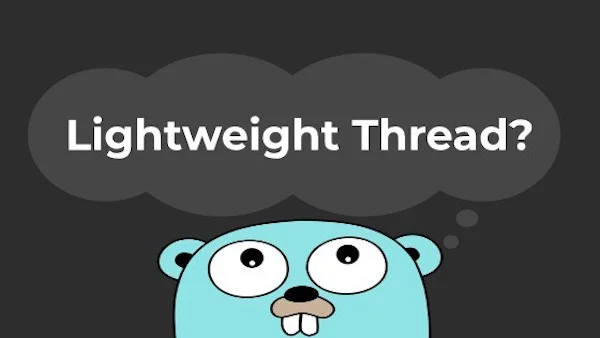
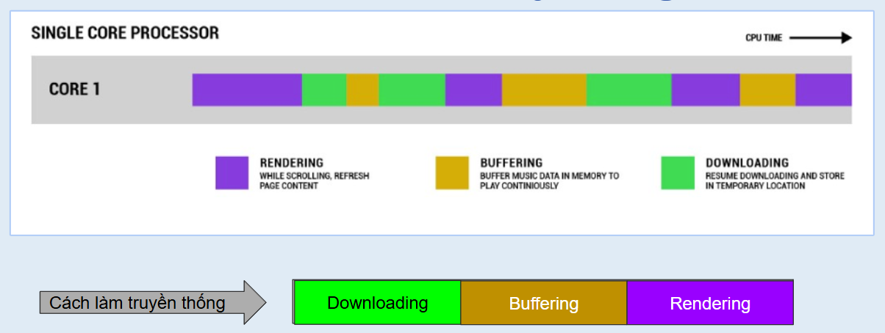
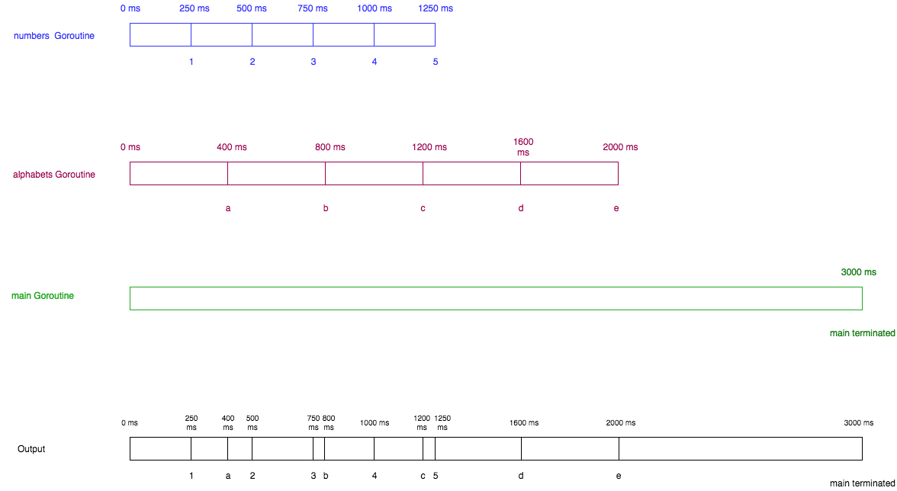
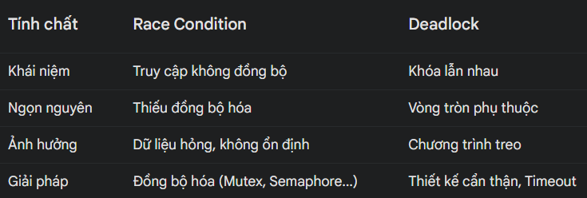
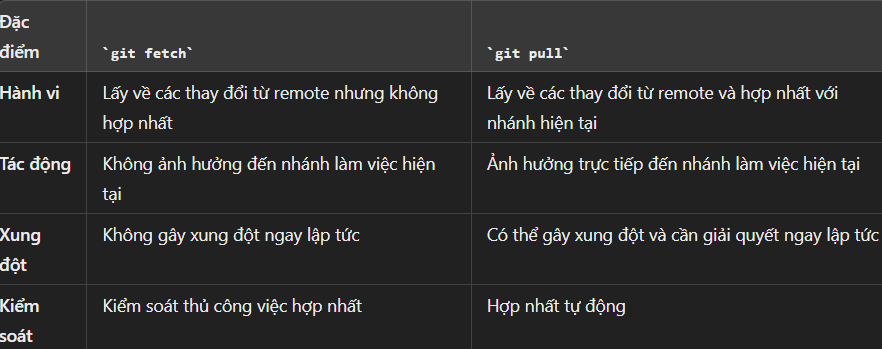

# Chuẩn bị tuần 1
## Nội dung chuẩn bị
- **Lập trình Go:** interface, struct, channel, goroutine, select, panic, recovery, go context, go modules, cách mà go xử lý error.
- **Cơ bản về framework:** go gin, gorm.
- **Tìm hiểu về git:** git CLI
## Table of content
- [A. Lập trình go](#a-lập-trình-go) 
    - [I. Struct](#i-struct)     
    - [II. Interface](#ii-interface)     
    - [III. Goroutine](#iii-goroutine)        
    - [IV. Channel](#iv-channel)    
    - [V. Select](#v-select)
    - [VI. Panic](#vi-panic)
    - [VII. Recover](#vii-recover)
    - [VIII. Go context](#viii-go-context)
    - [IX. Go modules](#ix-go-modules)
    - [X. Cách mà go xử lý error.](#x-cách-mà-go-xử-lý-error)
- [B. Cơ bản về framework: Go gin, gorm](#b-cơ-bản-về-framework-go-gin-gorm) 
    - [I. Go gin](#i-go-gin)     
    - [II. Go Gorm](#ii-go-gorm)    
- [C. Cơ bản về Git: Git Cli](#c-cơ-bản-về-git-git-cli)
## A. Lập trình go
### I. Struct
- **Struct** là một kiểu dữ liệu **tập hợp nhóm các giá trị có liên quan lại với nhau.** 
- Struct rất hữu ích để **mô hình hóa các đối tượng thực tế và các thực thể trong ứng dụng.**
- Khai báo struct:

    ```go
    type nameStruct struct{
        //Attribute
    }
    ```
#### 1. Khởi tạo và cách truy cập struct
- Sử dụng tên các thuộc tính:

    ```go
    p := person{Name: "Minh", Age: 20}
    ```
- Sử dụng thứ tự các trường:

    ```go
    p := person{"Minh", 20}
    ```
- Khởi tạo rỗng và gán giá trị sau:

    ```go
    var p person
    p.name = "Minh"
    p.age = 21
    ```
- Truy cập struct: Sử dụng dấu (.) để truy cập thuộc tính:

    ```go
    fmt.Printf(p.name)
    ```
#### 2. Anonymous struct
- **Anonymous structs** là một công cụ mạnh mẽ cho phép tạo ra các kiểu struct mà **không cần định nghĩa chúng trước một cách rõ ràng.** 
- Anonymous structs rất hữu ích khi cần một cấu trúc dữ liệu đơn giản cho **mục đích tạm thời hoặc khi không cần sử dụng kiểu struct đó ở nhiều nơi.**
- Example

    ```go
    func main() {
        // Tạo một anonymous struct
        person := struct {
            Name    string
            Age     int
            Address string
        }{
            Name:    "Minh",
            Age:     20,
            Address: "NA",
        }
    }
    ```
#### 3. Phương thức trong struct
- Struct có thể có các phương thức (method). Phương thức là một hàm gắn liền với một struct.
- Example:
    ```go
    type getName func(string) string
    type Person struct {
        Name string
        Get  getName
    }

    func main() {
        p := Person{
            Name: "Minh",
            Get: func(Name string) string {
                return "this is " + Name
            },
        }
        fmt.Println(p.Get(p.Name))
    }
    ```
#### 4. Embed struct
- **Struct embed** cho phép nhúng một struct vào trong một struct khác. Đây là một cách để tạo ra các kiểu **dữ liệu phức hợp và cung cấp cơ chế kế thừa hành vi.**

    ```go
    type Address struct {
        street string
        city string
    }

    type Person struct {
        name string
        age int
        Address
    }

    func main() {
        p := Person{
            name: "Minh", 
            age: 20,
            Address: Address{
                street: "15",
                city: "Paris",
            },
        }
        fmt.Println(p)
    }
    ```
#### 5. Pointer struct
- Có thể sử dụng con trỏ để tham chiếu đến struct. Điều này hữu ích khi muốn truyền struct tới hàm mà **không cần sao chép toàn bộ dữ liệu.**
- Example:

    ```go
    type Rectangle struct {
        width, height float64
    }

    func change(r *Rectangle) {
        r.width *= 2
    }

    func main() {
        r := Rectangle{1, 2}
        change(&r)
        fmt.Println(r)
    }
    ```
#### 6. Struct tag
- **Struct tag** là chuỗi metadata được gán cho các trường của struct. 
- Chúng thường được sử dụng để cấu hình cách struct được mã hóa hoặc giải mã khi **làm việc với các thư viện như encoding/json, xml, yaml, form.**
- Example

    ```go
    type Person struct {
        Name    string `json:"name"`
        Age     int    `json:"age"`
        Address string `json:"address,omitempty"`//tag omitempty bỏ qua trường nếu giá trị rỗng
    }

    func main() {
        p := Person{Name: "Minh", Age: 20}
        data, _ := json.Marshal(p)
        fmt.Println(string(data))
    }
    Output: {"name":"Minh","age":20}
    ```
- Giải thích:
    - **json:"name":** Chỉ định rằng trường Name sẽ được ánh xạ tới khóa "name" trong JSON.
    - **json:"age":** Chỉ định rằng trường Age sẽ được ánh xạ tới khóa "age" trong JSON.
    - **json:"address,omitempty":** Chỉ định rằng trường Address sẽ được ánh xạ tới khóa "address" trong JSON, và nếu trường Address có giá trị rỗng, nó sẽ bị bỏ qua trong JSON.
#### 7. JSON Marshaling/Unmarshaling
- **JSON marshaling** (chuyển đổi struct thành JSON) và **JSON unmarshaling** (chuyển đổi JSON thành struct) là các quy trình chuyển đổi dữ liệu giữa các định dạng JSON và struct trong Go.
- Json Marshaling:

    ```go
    type Person struct {
        Name string `json:"name"`
        Age  int    `json:"age,omitempty"`
    }

    func main() {
        p := Person{Name: "Minh"}
        data, err := json.Marshal(p)
        if err != nil {
            fmt.Println(err)
            return
        }
        fmt.Println(string(data))
    }
    ```
- Json Unmashaling

    ```go
    type Person struct {
        Name string `json:"name"`
        Age  int    `json:"age"`
    }

    func main() {
        jsonData := `{"name":"Minh","age":20}`
        var p Person
        err := json.Unmarshal([]byte(jsonData), &p)
        if err != nil {
            fmt.Println(err)
            return
        }
        fmt.Println(p)
    }
    ```
### II. Interface
- **Interface** là một tập hợp **các phương thức trừu tượng (không có phần thân) và các hằng số (constant)**. Nó được sử dụng để chỉ định **một nhóm phương thức mà một lớp** phải triển khai.
- Khai báo interface:

    ```go
    type interfaceName interface{
        //Method
    }
    ```
#### 1. Implement interface
- Một loại (type) triển khai một interface **bằng cách định nghĩa tất cả các phương thức trong interface đó.** Go không có từ khóa implements như trong một số ngôn ngữ khác, **việc triển khai là ngầm định.**
- Example:

    ```go
    type Animal interface {
        speak()
    }

    type dog struct {
    }

    func (d dog) speak() {
        fmt.Println("Go")
    }

    func main() {
        var ani Animal = dog{}
        ani.speak()
    }
    ```
#### 2. Empty interface
- **Empty interface** có thể chứa bất kỳ giá trị nào. Đây là một cách để **lưu trữ các giá trị không biết trước loại cụ thể.**
- Example

    ```go
    func describe(i interface{}) {
        fmt.Printf("Value: %v, Type: %T\n", i, i)
    }
    func main() {
        describe(123)
        describe(1.2)
        describe("Go")
    }

    Output:
    Value: 123, Type: int
    Value: 1.2, Type: float64
    Value: Go, Type: string
    ```
- Kiểm tra kiểu với Switch

    ```go
    func checkType(i interface{}) {
        switch v := i.(type) {
        case string:
            fmt.Println("String:")
        case int:
            fmt.Println("Int:")
        default:
            fmt.Println("Unknown type")
        }
    }

    func main() {
        DoSomething("hello")
        DoSomething(123)
        DoSomething(true)
    }
    ```
#### 3. Multiple interface
- Một loại có thể triển khai một interface cùng lúc.
- Example

    ```go
    type Animal interface {
        speak()
    }

    type Activity interface {
        look(s string)
    }
    type dog struct {
    }

    func (d dog) speak() {
        fmt.Println("Go")
    }

    func (d dog) look(s string) {
        fmt.Println(s)
    }

    func main() {
        d := dog{}
        d.speak()
        d.look("Clock")
    }
    ```
#### 4. Type assertion
- Type assertion được sử dụng để lấy giá trị cụ thể từ một giá trị kiểu interface
- Example:

    ```go
    func main() {
        var i interface{} = "Go"

        s, okString := i.(string)
        fmt.Println(s, okString)

        f, okFloat := i.(float64)
        fmt.Println(f, okFloat)
    }
    ```
#### 5. Stringer
- Go cung cấp một số interface phổ biến như Stringer từ gói fmt cho phép định nghĩa cách in giá trị.
- Example

    ```go
    func (c cat) string() string {
        return fmt.Sprintf("%s %d", c.name, c.age)
    }
    func main() {
        c := cat{"Cat", 2}
        fmt.Println(c)
    }
    ```
#### 6. Embed interface
- Một interface có thể nhúng (embed) **một hoặc nhiều interface khác.**
- Example

    ```go
    type Animal interface {
        speak()
    }

    type Activity interface {
        look(s string)
    }

    type Cover interface {
        Animal
        Activity
    }
    type dog struct {
    }

    func (d dog) speak() {
        fmt.Println("Go")
    }

    func (d dog) look(s string) {
        fmt.Println(s)
    }

    func main() {
        d := dog{}
        var cov Cover = d
        cov.look("Go")
        cov.speak()
    }
    ```
#### 7. Pointer interface
- Sử dụng con trỏ (pointer) làm đối số cho một interface.
- Example:

    ```go
    type Animal interface {
        speak()
    }

    type dog struct{}

    func (d *dog) speak() {
        fmt.Println("Go")
    }

    func main() {
        d := dog{}
        var ani Animal = &d
        ani.speak()
    }
    ```
#### 8. Slices interface
- Interface slice là một cấu trúc dữ liệu trong Go cho phép lưu trữ một tập hợp các giá trị, mỗi giá trị có thể **thuộc bất kỳ kiểu dữ liệu nào miễn là chúng thực hiện cùng một interface.**
- Mang lại sự **linh hoạt rất lớn trong việc quản lý các đối tượng có các kiểu dữ liệu khác nhau nhưng có chung một tập hợp các hành vi.**
- Example:

    ```go
    type Shape interface {
        area() float64
    }

    type Rectangle struct {
        width, height float64
    }

    func (r Rectangle) area() float64 {
        return r.width * r.height
    }

    type Circle struct {
        radius float64 //bán kính
    }

    func (c Circle) area() float64 {
        return c.radius * c.radius * math.Pi
    }

    func main() {
        shape := []Shape{Rectangle{1, 2}, Circle{5}}
        for _, v := range shape {
            fmt.Println(v.area())
        }
    }
    ```
#### 9. Đối số trong interface
- Việc sử dụng interface làm đối số của một hàm trong Go là một cách hiệu quả để tận dụng **tính linh hoạt và trừu tượng của interface.**
-  Khi sử dụng interface làm đối số, có thể viết **các hàm tổng quát mà có thể làm việc với bất kỳ kiểu dữ liệu nào triển khai interface đó.**
- Example

    ```go
    type Shape interface {
        area() float64
    }

    type Rectangle struct {
        width, height float64
    }

    func (r Rectangle) area() float64 {
        return r.width * r.height
    }

    type Circle struct {
        radius float64 //bán kính
    }

    func (c Circle) area() float64 {
        return c.radius * c.radius * math.Pi
    }

    func printInfo(s Shape) {
        fmt.Println(s.area())
    }

    func main() {
        shape := []Shape{Rectangle{1, 2}, Circle{5}}
        for _, v := range shape {
            printInfo(v)
        }
    }
    ```
### III. Goroutine
#### 1. Bản chất

- **Goroutines** bản chất là các hàm (function) hay method được thực thi một các độc lập và đồng thời nhưng vẫn có thể kết nối với nhau.
- Trong bất kỳ một chương trình Golang **đều tồn tại ít nhất một Goroutine, gọi là main Goroutine.** Nếu main goroutines này kết thúc, toàn bộ các goroutines khác trong chương trình cũng đều bị dừng và kết thúc ngay.
- Goroutine là **một lightweight execution thread (luồng thực thi gọn nhẹ).** Vì thế việc sử dụng các Goroutines trong Golang có **chi phí cực kì thấp** so với cách sử dụng các Thread truyền thống (OS Thread).
- Goroutine hoạt động dựa trên **cơ chế concurrency.**
#### 2. Concurrency
- **Concurrency** là khả năng 1 chương trình có thể điều phối nhiều tác vụ trong cùng một khoảng thời gian và trong quá trình điều phối chỉ **cho phép 1 tác vụ chạy trong 1 thời điểm.**


- **Hiểu đơn giản:** Download đến đâu thì hiển thị đến đó, download đến đâu thì buffer(sàng lọc dữ liệu) đến đó, làm tăng khả năng phản hồi cao, người dùng không phải đợi download xong trang web mới xem được toàn bộ trang web.
- **Lý do sử dụng Concurrency:**
    - Tận dụng tối đa CPU (1 core or >= 2 cores).
    - Tăng tính phản hồi của ứng dụng.
#### 3. Lý do sử dụng goroutine
- Lý do:
    - Goroutine **được quản lý bởi go runtime** không phụ thuộc vào phần cứng.
    - Stack size của Goroutine khoảnh 2 Kb, có thể tăng tới 1GB, có thể linh động tăng giảm bộ nhớ sử dụng.
    - **Đồng thời hóa:** Goroutine cho phép thực hiện nhiều tác vụ cùng một lúc, tăng hiệu suất ứng dụng.
    - Goroutines có thể giao tiếp an toàn với nhau thông qua các kênh trong Golang (Channel). Các channel hỗ trợ mutex lock vì thế **tránh được các lỗi liên quan tới cùng ghi và đọc lên vùng dữ liệu chia sẻ (data race).**
#### 4. Khai báo và cách sử dụng 
- Bất kì một hàm nào trong Golang cũng đều có thể chạy đồng thời hay Goroutines với việc thêm vào **từ khoá go.**
- Example:

    ```go
    func say() {
        for i := 1; i <= 5; i++ {
            fmt.Println(i)
        }
    }

    func main() {
        go say()
        time.Sleep(time.Second)
    }
    ```
#### 5. Multiple goroutines
- Có thể sử dụng nhiều goroutine cùng một lúc.

    ```go
    func numbers() {  
        for i := 1; i <= 5; i++ {
            time.Sleep(250 * time.Millisecond)
            fmt.Printf("%d ", i)
        }
    }
    func alphabets() {  
        for i := 'a'; i <= 'e'; i++ {
            time.Sleep(400 * time.Millisecond)
            fmt.Printf("%c ", i)
        }
    }
    func main() {  
        go numbers()
        go alphabets()
        time.Sleep(3000 * time.Millisecond)
        fmt.Println("Go")
    }
    Output: 1 a 2 3 b 4 c 5 d e Go
    ```
- Chương trình trên sẽ chạy như sau:

#### 6. Anonymous goroutines
- **Anonymous goroutines** là các goroutines được khởi tạo **từ các hàm ẩn danh (anonymous functions).** Các hàm này không có tên và thường được khai báo trực tiếp tại nơi chúng được sử dụng.
- Example

    ```go
    func main() {
        go func() {
            fmt.Println("Go")
        }()
        time.Sleep(time.Second)
    }
    ```
#### 7. Vấn đề capture variable
- Khi tạo một goroutine và truyền một biến vào trong đó, goroutine đó sẽ **capture (bắt giữ) một bản sao của biến đó tại thời điểm tạo goroutine.** Điều này có nghĩa là, nếu giá trị của biến gốc thay đổi sau khi goroutine được tạo, goroutine sẽ **vẫn sử dụng giá trị đã được capture.**
- Example

    ```go
    func main() {
        for i := 0; i < 5; i++ {
            go func() {
                fmt.Println(i)
            }()
        }

        time.Sleep(1 * time.Second)
    }
    Output: 
    4
    2
    3
    0
    1
    ```
#### 8. WaitGroup
- WaitGroup là một cơ chế đồng bộ hóa trong Go, cho phép chờ cho đến khi **một số lượng goroutine nhất định hoàn thành công việc của chúng**. 
- Nó đặc biệt hữu ích khi cần khởi chạy nhiều goroutine để thực hiện các tác vụ độc lập, nhưng muốn **đảm bảo tất cả chúng đều kết thúc** trước khi tiến hành bước tiếp theo.
    - Example:

    ```go
    func main() {
        var wg sync.WaitGroup
        for i := 1; i < 5; i++ {
            wg.Add(1)
            go func() {
                fmt.Println("Go")
                wg.Done()
            }()
        }
        wg.Wait()
        fmt.Println("Done")
    }
    ```
- **Lưu ý:** Khi thêm số lượng vào waitgroup nhiều hơn lượng công việc cần làm gây ra hiện tượng deadlock.
- **Deadlock** là vấn đề xảy ra khi hai hoặc nhiều luồng đang chờ đợi tài nguyên do **các luồng khác nắm giữ, tạo thành một vòng tròn phụ thuộc.** Không có luồng nào có thể giải phóng tài nguyên mà nó đang chờ đợi, **dẫn đến việc tất cả các luồng bị treo (stuck) và chương trình không thể thực hiện được.**
#### 9. Mutex
- **sync.Mutex** là một công cụ đồng bộ hóa được sử dụng để **kiểm soát truy cập đồng thời vào các tài nguyên chia sẻ** như biến hoặc cấu trúc dữ liệu.
- **Mutex** đảm bảo rằng chỉ một goroutine có thể **giữ khóa tại một thời điểm,** **giúp ngăn chặn các điều kiện đua (race conditions)** khi nhiều goroutine cùng truy cập hoặc thay đổi dữ liệu chia sẻ.
- **Race condition** là vấn đề xảy ra khi nhiều luồng truy cập và sửa đổi cùng một tài nguyên chia sẻ mà **không được đồng bộ hóa đúng cách.** Điều này dẫn đến kết quả **không thể dự đoán trước và phụ thuộc vào thứ tự thực thi của các luồng.**

- Example

    ```go
    func main() {
        var wg sync.WaitGroup
        var m sync.Mutex
        wg.Add(4)
        val := 1
        for i := 1; i < 5; i++ {
            go func() {
                m.Lock()
                defer m.Unlock()
                val++
                fmt.Println(val)
                wg.Done()
            }()
        }
        wg.Wait()
        fmt.Println("Done")
    }
    ```
- **Tổng quan defer:**
    - **defer** là một từ khóa được sử dụng để trì hoãn việc thực thi của một hàm hoặc biểu thức **cho đến khi hàm bao quanh nó trả về.** Các lệnh defer thường được sử dụng để **đảm bảo rằng tài nguyên được giải phóng hoặc hành động dọn dẹp được thực hiện,** ngay cả khi xảy ra lỗi hoặc hàm thoát sớm.

    ```go
    func main() {
        fmt.Println("1")
        defer fmt.Println("2")
        fmt.Println("3")
        defer fmt.Println("4")
        fmt.Println("5")
    }
    ```
    - **Lưu ý:** Các lệnh defer được thực thi theo **thứ tự ngược lại so với thứ tự mà chúng được khai báo.** Nghĩa là lệnh defer cuối cùng được khai báo sẽ được thực thi đầu tiên.
#### 10. Atomic operation(Các phép toán nguyên tử)
- **Gói sync/atomic** cung cấp các phép toán nguyên tử để thực hiện các thao tác trên **các biến chia sẻ một cách an toàn và không cần khóa (lock-free).** 
- Các phép toán nguyên tử rất hữu ích trong lập trình đồng thời (concurrent programming) khi cần thực hiện các phép toán đơn giản như **tăng, giảm, hoặc hoán đổi giá trị của các biến chia sẻ mà không phải lo lắng về điều kiện đua (race conditions).**
- Các phép toán nguyên tử phổ biến trong go

    ```go
    func main() {
        var cnt int32 = 0
        atomic.AddInt32(&cnt, 1)  // Tăng giá trị
        atomic.AddInt32(&cnt, -1) // Giảm giá trị

        var a int32 = 5
        swapped := atomic.CompareAndSwapInt32(&a, 2, 3) // So sánh và đổi giá trị
        fmt.Println(swapped)

        val := atomic.LoadInt32(&a) // Tải giá trị
        fmt.Println(val)

        atomic.StoreInt32(&a, 20) // Lưu giá trị
        fmt.Println(a)
    }
    ```
- Ví dụ của Atomic trong goroutine:

    ```go
    var count int32

    func increment() {
        for i := 0; i < 1000; i++ {
            count++
        }
    }

    func main() {
        var wg sync.WaitGroup
        wg.Add(2)

        go func() {
            defer wg.Done()
            increment()
        }()

        go func() {
            defer wg.Done()
            increment()
        }()

        wg.Wait()
        fmt.Println(count)
    }
    ```
- Hai goroutine được chạy song song, sử dụng atomic giúp việc tăng giá trị của count được thực thi một cách an toàn tránh bị **race conditions**
###  IV. Channel
- **Channel** là một cơ chế đồng bộ hóa và truyền thông **giữa các goroutine trong Go.** Nó đóng vai trò như một ống dẫn, cho phép các goroutine **gửi và nhận dữ liệu** với nhau một cách an toàn và hiệu quả.
- Lý do cần Channel:
    - **Đồng bộ hóa:** Channel đảm bảo các goroutine chạy đồng thời không truy cập cùng một dữ liệu một cách tùy tiện, **tránh tình trạng race condition.**
    - **Truyền thông:** Channel là phương thức chính để **các goroutine trao đổi thông tin.**
    - **Kiểm soát luồng:** Channel có thể được sử dụng để điều khiển luồng thực thi của các goroutine, ví dụ như chờ đợi một sự kiện xảy ra.
#### 1. Buffered channel và unbuffered channel
#####  a. Unbuffered channel
- Không có bộ nhớ đệm
- Khi một goroutine gửi dữ liệu vào unbuffered channel, nó sẽ bị block cho đến khi có **một goroutine khác sẵn sàng nhận dữ liệu đó.**
- khi một goroutine **cố gắng nhận dữ liệu từ một unbuffered channel mà chưa có dữ liệu nào được gửi vào,** goroutine đó cũng sẽ bị block.
- Cú pháp:

    ```go
    nameChannel := make(chan int)
    ```
- Ex:

    ```go
    func main() {
        ch := make(chan int)
        go func() {
            ch <- 5 // Goroutine này sẽ bị chặn cho đến khi có giá trị được nhận
            fmt.Println("Hello")
        }()
        x := <-ch // Goroutine main sẽ bị chặn cho đến khi nhận giá trị
        fmt.Println("HIHI")
        fmt.Println(x)
    }
    ```
#####  b. Buffered channel
- Khi gửi dữ liệu vào buffered channel, goroutine sẽ chỉ **bị block khi bộ nhớ đệm đã đầy.**
- Khi nhận dữ liệu từ buffered channel, goroutine sẽ chỉ **bị block khi bộ đệm rỗng.**
- Cú pháp:

    ```go
    nameChannel := make(chan int, 2)
    ```
- Ex:

    ```go
    func main() {
        ch := make(chan int, 2)
        ch <- 1
        ch <- 2
        fmt.Println(<-ch, <-ch)
    }
    ```
- **Lưu ý:**
    - Khi bộ đệm của buffered channel đầy, bất kỳ nỗ lực gửi giá trị mới vào channel sẽ **bị chặn cho đến khi có chỗ trống trong bộ đệm.**
    - Khi bộ đệm trống, bất kỳ nỗ lực nhận giá trị từ channel sẽ **bị chặn cho đến khi có giá trị mới được gửi vào channel.**
#### 2. Close channel
- **Close channel** là một thao tác quan trọng trong việc quản lý vòng đời của channel trong Go. 
- Khi một channel được đóng, nó báo hiệu rằng **không còn dữ liệu nào sẽ được gửi vào channel đó nữa**. Điều này giúp các goroutine **nhận dữ liệu từ channel biết khi nào nên dừng việc nhận dữ liệu.**
- Lý do cần đóng channel:
    - **Thông báo kết thúc:** Đóng channel là một cách hiệu quả để thông báo cho các goroutine khác rằng quá trình xử lý dữ liệu đã hoàn tất hoặc có lỗi xảy ra.
    - **Ngăn chặn deadlock:** Đóng channel đúng lúc có thể giúp tránh tình trạng deadlock khi các goroutine chờ đợi dữ liệu từ một channel đã bị đóng.
    - **Quản lý tài nguyên:** Đóng channel giúp giải phóng các tài nguyên liên quan đến channel.
- Cú pháp:

    ```go
    close(nameChannel)
    ```
- **Lưu ý khi đóng Channel:**
    - Chỉ đóng một lần => lỗi runtime
    - Không gửi dữ liệu khi đóng => lỗi runtime
    - Nhận dữ liệu sau khi đóng: Các goroutine vẫn nhận cho đến khi hết.
- Ex:

    ```go
    ch := make(chan int, 5)
        go func() {
            for i := 1; i <= 5; i++ {
                ch <- i
            }
            close(ch) // Nếu không có close thì sẽ xảy ra hiện tượng deadlock
        }()
        for v := range ch {
            fmt.Println(v)
        }
    ```
- Kiểm tra close channel:

    ```go
    if v, ok := <-ch; !ok {
        fmt.Println("Close channel")
        break
    }
    ```
###  V. Select
- Select được sử dụng để xử lý các hoạt động đồng thời với **các channels**
- Selec cho phép lắng nghe nhiều kênh đồng thời và thực thi một nhánh mã tương ứng khi **một kênh nào đó sẵn sàng để gửi nhận dữ liệu.**
#### 1. Cú pháp và cách hoạt động
- Cú pháp: 

    ```go
    select {
        case exp1:
            //xử lý
        case exp2:
            //xử lý
        default:
            //xử lý khi không có case nào sẵn sàng
        }
    ```
- Cách hoạt động:
    - **Nghe nhiều kênh:** select có thể theo dõi được nhiều kênh khác nhau.
    - **Chọn một case:** select sẽ cố gắng chọn một case sẵn sàng để thực thi.
    - **Ngẫu nhiên:** Khi nhiều case sẵn sàng thì go chọn 1 case ngẫu nhiên để thực thi.
    - **Default:** Nếu không có TH nào sẵn sàng, default(nếu có) sẽ được thực thi
#### 2. Lưu ý khi sử dụng select
- **Không có thứ tự đảm bảo:** Trừ khi có một trường hợp duy nhất sẵn sàng, việc chọn trường hợp là ngẫu nhiên.
- **default:** Nếu không có trường hợp nào sẵn sàng và không có default, select sẽ bị chặn cho đến khi có một trường hợp sẵn sàng.
- **Kết hợp với for:** select thường được sử dụng trong các vòng lặp for để tạo các vòng lặp không chặn hoặc chờ đợi các sự kiện nhất định.

#### 3. Empty select
- Khi sử dụng empty select sẽ gây ra hiện tượng deadlock
- Cú pháp:
    ```go
    select{}
    ```
#### 4. Ví dụ
- Ex:

    ```go
    func main() {
        ch1 := make(chan int)
        ch2 := make(chan int)

        go func() {
            ch1 <- 1
        }()

        go func() {
            ch2 <- 2
        }()


        for i := 1; i <= 3; i++ {
            select {
            case val1 := <-ch1:
                fmt.Println(val1)
            case val2 := <-ch2:
                fmt.Println(val2)
            default:
                fmt.Println("Done")
            }
        }
    }
    ```
###  VI. Panic
#### 1. Tổng quan
- **Panic** là một cơ chế đặc biệt để **báo hiệu các lỗi nghiêm trọng, không thể phục hồi trong quá trình thực thi chương trình.** 
- Khi một hàm gọi panic(), chương trình sẽ **ngừng thực thi bình thường và bắt đầu quá trình "panic".**
#### 2. Khi nào sử dụng Panic
- **Lỗi không thể phục hồi:** Khi gặp một lỗi mà chương trình **không thể tiếp tục hoạt động một cách chính xác**, chẳng hạn như lỗi về bộ nhớ, lỗi hệ thống nghiêm trọng.
- **Bảo vệ tính toàn vẹn của dữ liệu:** Để ngăn chặn việc ghi dữ liệu sai hoặc gây ra các hậu quả không mong muốn khác.
#### 3. Cơ chế hoạt động của panic
- **Dừng thực thi:** Khi một hàm gọi panic(), nó sẽ **dừng thực thi ngay lập tức.**
- **Thực thi các hàm defer:** Các hàm được khai báo bằng từ khóa defer trong hàm hiện tại và các hàm cha **sẽ được thực thi theo thứ tự ngược lại.**
- **Truyền panic lên trên:** Panic sẽ được **truyền lên hàm gọi cái hàm có panic(),** và lặp lại cho đến khi không còn hàm nào nữa.
- **Kết thức chương trình:** Nếu không có hàm nào bắt được panic thì chương trình sẽ kết thúc và in ra thông báo lỗi.
- Ex:
    ```go
    func check() {
        panic("Lỗi nghiêm trọng!")
    }
    func main() {
        defer func() {
            if r := recover(); r != nil {
                fmt.Println("Có lỗi xảy ra:", r)
            }
        }()
        check()
    }
    ```
#### 4. Lưu ý khi sử dụng Panic
- **Sử dụng cẩn thận:** Chỉ nên sử dụng panic khi thực sự cần thiết.
- **Xử lý panic bằng defer và recover:** Để ngăn chặn chương trình bị crash, **hãy sử dụng defer và recover để bắt và xử lý panic.**
- **Tránh lạm dụng panic:** Việc lạm dụng panic có thể làm cho code khó đọc và khó bảo trì.
###  VII. Recover
#### 1. Tổng quan
- **Recover** là một cơ chế mạnh mẽ để **bắt giữ các panic và ngăn chặn chương trình bị crash hoàn toàn.**
- Khi một goroutine gặp phải một panic (ví dụ như chia cho 0, truy cập mảng vượt quá giới hạn), nếu không được xử lý, chương trình **sẽ dừng lại đột ngột.** Recover cho phép **bắt giữ những panic này,** thực hiện các hành động xử lý lỗi, và **tiếp tục thực thi chương trình một cách ổn định.**
#### 2. Lý do sử dụng recover
- **Ngăn chặn chương trình crash:** Thay vì để chương trình bị dừng đột ngột, recover giúp **duy trì sự ổn định của ứng dụng.**
- **Xử lý lỗi một cách linh hoạt:** Có thể tùy chỉnh cách xử lý lỗi, gửi thông báo, hoặc thực hiện các hành động khác.
- **Bảo vệ dữ liệu:** Recover **giúp ngăn chặn việc mất dữ liệu** do chương trình bị crash giữa chừng.
#### 3. Cơ chế hoạt động của recover
- Khi panic được gọi, chương trình sẽ **bắt đầu tìm kiếm các hàm deferred để thực thi.** Khi nó tìm thấy hàm deferred, nó sẽ gọi hàm đó.
- Trong hàm deferred, nếu gọi recover, hàm này sẽ trả về giá trị của panic nếu có. Nếu không có panic xảy ra, recover sẽ trả về nil.
#### 4. Lưu ý khi sử dụng recover
- **Recover chỉ hoạt động trong hàm hiện tại và các hàm gọi nó.** Nếu panic xảy ra ở một goroutine khác, recovery trong goroutine hiện tại sẽ không bắt được.
- **recover chỉ hoạt động trong hàm deferred:** Nếu bạn gọi recover ngoài hàm deferred, nó sẽ luôn trả về nil và không có hiệu quả gì.
#### 5. Ví dụ
- Ex:
    ```go
    func rec1() {
        defer func() {
            if r := recover(); r != nil {
                fmt.Println("rec1")
            }
        }()
        panic("Panic ne")
    }
    func rec2() {
        defer func() {
            if r := recover(); r != nil {
                fmt.Println("rec2")
            }
        }()
        rec1()
    }
    func main() {
        rec2()
        fmt.Println("continue")
    }
    ```
###  VIII. Go context
#### 1. Overview
- **Context** là một gói (package) mạnh mẽ được sử dụng để truyền tải các thông tin về thời gian sống (lifetime), thời gian hết hạn (deadline), tín hiệu hủy bỏ (cancellation signals) và các giá trị khác qua các ranh giới API và các goroutine.
    - Interface context

    ```go
    type Context interface {
        Deadline() (deadline time.Time, ok bool)
        Done() <-chan struct{}
        Err() error
        Value(key any) any
    }
    ```
#### 2. Functions Context
#####  a. Background
- Trả về **một context trống**. Đây thường là **context gốc và không bao giờ bị hủy bỏ, không có giá trị hay thời gian hết hạn.**
- Thường sử dụng làm điểm bắt đầu để tạo các context con

    ```go
    ctx := context.Background()
    ```
#####  b. TODO
- Tương tự như context.Background(), nhưng được sử dụng khi chưa biết chắc chắn context nào phù hợp.
- Thường sử dụng trong quá tình phát triển hoặc khi dự định thay thế nó bằng một context cụ thể sau này.

    ```go
    ctx := context.TODO()
    ```
#####  c. WithTimeout
- Tạo context có thời hạn, tự động hủy sau một khoảng thời gian nhất định.
- Thường sử dụng khi muốn một tác vụ tự động dừng lại sau một thời gian cụ thể tránh bị treo

    ```go
    func main() {
        ctx, cancel := context.WithTimeout(context.Background(), 2*time.Second)
        defer cancel()
        select {
        case <-ctx.Done():
            fmt.Println(ctx.Err())
        }
    }
    ```
#####  d. WithCancel
- Tạo một context không có thời gian và có thể hủy bỏ bằng cách gọi hàm cancel().
- Thường dùng khi muốn kiểm soát việc hủy bỏ một context một cách thủ công.

    ```go
    func main() {
        ctx, cancel := context.WithCancel(context.Background())
        time.AfterFunc(time.Second, func() {
            cancel()
        })
        select {
        case <-ctx.Done():
            fmt.Println(ctx.Err())
        }
    }
    ```
#####  e. WithValue
- Tạo một context chứa các giá trị bổ sung, các context con có thể kế thừa các context cha.
- Thường để dùng truyền thông tin bổ sung giữa các hàm  một cách đơn giản hơn.

    ```go
    func check(ctx context.Context, k string) {
        if ok := ctx.Value(k); ok != nil {
            fmt.Println("Found")
            return
        }
        fmt.Println("Not found")
    }
    func main() {
        ctx := context.WithValue(context.Background(), "Go", 10)
        check(ctx, "Hi")
        check(ctx, "Go")
    }
    ```
#####  f. WithoutCancel
- Tạo một context con từ một context cha, sao cho khi hủy bỏ con context cha sẽ không ảnh hưởng đến context con.
- Tạo context để ngăn chặn hủy bỏ không mong muốn và tạo context con có thể hoạt động một cách độc lập.
    ```go
    func main() {
        ctx, cancel := context.WithCancel(context.Background())
        ctxWithoutCancel := context.WithoutCancel(ctx)

        go func() {
            for {
                select {
                case <-ctxWithoutCancel.Done():
                    fmt.Println("WithoutCancel")
                case <-time.After(time.Second):
                    fmt.Println("Go")
                }
            }
        }()
        time.Sleep(5 * time.Second)
        cancel()
        time.Sleep(3 * time.Second)
    }
    ```
#####  g. AfterFunc
- Hàm cho phép hẹn thời gian thực thi sau một khoảnh thời gian nhất định.
    ```go
    func main() {
        ctx, cancel := context.WithCancel(context.Background())
        time.AfterFunc(2*time.Second, func() {
            select {
            case <-ctx.Done():
                fmt.Println("Go")
            default:
                fmt.Println("Lang")
            }
        })
        go func() {
            time.Sleep(2 * time.Second)
            cancel()
        }()
        time.Sleep(5 * time.Second)
    }
    ```
#####  h. Deadline
- Hàm dùng để tạo ra một context mới có thời hạn cụ thể. **Khi thời hạn này hết, context sẽ tự động bị hủy bỏ.**
- Cú pháp:
    ```go
    func WithDeadline(parent context.Context, t time.Time) (context.Context, cancel func())
    ```
- Ví dụ:
    ```go
    func main() {
        dl := time.Now().Add(3 * time.Second)
        ctx, cancel := context.WithDeadline(context.Background(), dl)
        defer cancel()
        go func() {
            for {
                select {
                case <-ctx.Done():
                    fmt.Println("End")
                    return
                case <-time.After(1 * time.Second):
                    fmt.Println("Continue")
                }
            }
        }()
        <-ctx.Done()
        fmt.Println("KT")
    }
    ```
- Ngoài ra có thể cancel trước deadline
    ```go
    func main() {
        dl := time.Now().Add(5 * time.Second)
        ctx, cancel := context.WithDeadline(context.Background(), dl)
        defer cancel()
        go func(ctx context.Context) {
            for {
                select {
                case <-ctx.Done():
                    fmt.Println("End")
                    return
                case <-time.After(3 * time.Second):
                    fmt.Println("Continue")
                }
            }
        }(ctx)
        time.Sleep(2 * time.Second)
        cancel()
    }
    ```
###  IX. Go modules
#### 1. Tổng quan
- Go Modules là một hệ thống quản lý phụ thuộc trong Go, nó cung cấp một cách nhất quán và đơn giản để quản lý các gói Go trong dự án.
- Cấu trúc gồm 2 phần:
    - go.mod: Tệp chính để định danh module, chứa thông tin về tên module và các phụ thuộc của nó
    - go.sum: Tệp chứa checksum của các module để đảm bảo tính nhất quán của các phụ thuộc
#### 2. Cách sử dụng go
#####  a. Khởi tạo một module
- Lệnh sẽ tạo một file go.mod trong thư mục gốc của dự án, trong đó chứa thông tin module.

    ```go
    go mod init pathfile
    ```
#####  b. Thêm một gói phụ thuộc
- Lệnh này sẽ tải xuống gọi example.com/pkg và thêm nó vào file go.mod.

    ```go
    go get example.com/pkg
    ```
#####  c. Cập nhật các gói phụ thuộc
- Lệnh này sẽ cập nhật tất cả các gói phụ thuộc lên phiên bản mới nhất.

    ```go
    go get -u
    ```
- Lệnh này giúp cập nhật phiên bản mới nhất từng module

    ```go
    go get example/pkg@latest
    ```
#####  d. Xóa một gói phụ thuộc
- Lệnh này sẽ xóa gói example.com/pkg khỏi file go.mod.

    ```go
    go mod edit -rm example.com/pkg
    ```
#### 3. Các lệnh go module thường dụng
- **go mod tidy**: Sửa chữa file go.mod để chỉ chứa các module được sử dụng thực sự.
- **go mod verify**: Kiểm tra xem các module đã được tải xuống có khớp với thông tin trong file go.mod hay không.
- **go list -m all**: Liệt kê tất cả các module trong go.mod. 
- **go mod download**: Tải xuống các phụ thuộc được xác định trong go.mod.
###  X. Cách mà go xử lý error.
- Go xử lý lỗi bằng cách sử dụng các giá trị trả về và giao diện error.
#### 1. Cơ chế hoạt động
- **Giá trị lỗi:** Một lỗi thường biểu diễn bằng một giá trị, **cụ thể là error.**
- **Trả về nhiều giá trị:** Nhiều hàm trong go trả về hai giá trị: **kết quả chính và một giá trị lỗi.**
- **Kiểm tra lỗi:** Kiểm tra lỗi sau khi gọi hàm, **nếu lỗi xảy ra thì giá trị lỗi khác nil.**
- Ex:

    ```go
    func divide(a, b int) (int, error) {
        if b == 0 {
            return 0, errors.New("division by zero")
        } else {
            return a / b, nil
        }
    }
    func main() {
        result, err := divide(5, 0)
        if err != nil {
            fmt.Println(err)
        } else {
            fmt.Println(result)
        }
    }
    ```
#### 2. Một số thao tác trong xử lý lỗi
##### a. Tạo lỗi mới 
- Tạo lỗi bằng error.New()

    ```go
    func myFunction() error {
        return errors.New("errorpk")
    }
    ```
- Tạo lỗi bằng error.Errorf cho các lỗi cần thêm thông tin

    ```go
    func myFunction() error {
        return errors.Errorf("errorpk %v", time.Now())
    }
    ```
##### b. So sánh lỗi
- Sử dụng error.Is: Để so sánh lỗi này có thuộc vào một lỗi nào đó hay không

    ```go
    var ErrNotFound = errors.New("NotFound")
    func find(x int) error{
        if x==0{
            return ErrNotFound
        }
        return nil
    }
    func main() {
        err := find(0)
        if errors.Is(err, ErrNotFound){
            fmt.Println("Not found")
        }else{
            fmt.Println("Found")
        }
    }
    ```
- Sử dụng error.As: Kiểm tra xem lỗi đó có phải là lỗi của lỗi so sánh hay không, nó có thì lỗi so sánh được gán từ lỗi hiện tại.

    ```go
    type MyError struct {
        Msg string
    }

    func (e *MyError) Error() string {
        return e.Msg
    }

    func doST() error {
        return &MyError{"Error"}
    }
    func main() {
        err := doST()
        var myErr *MyError
        if errors.As(err, &myErr) {
            fmt.Println(myErr)
        } else {
            fmt.Println("Other errors")
        }
    }
    ```
##### c. Bọc lỗi
- Có thể bọc lỗi bằng việc giữ ngữ cảnh lỗi bằng sử dụng fmt.Errorf với %w để bọc lỗi gốc.

    ```go
    func outer() error {
        err := inner()
        if err != nil {
            return fmt.Errorf("failed: %w", err)
        }
        return nil
    }

    func inner() error {
        return errors.New("inner errorpk")
    }

    func main() {
        err := outer()
        if err != nil {
            fmt.Println("Error:", err)
        }
    }
    ```
#### 3. Custom error
##### a. Tổng quan
- **Custom error** là một cách hiệu quả để cung cấp thông tin chi tiếp hơn về lỗi xảy ra.
- Phân loại được các lỗi khác nhau để xử lý các tính huống lỗi khác nhau.
##### b. Cách tạo custom error
- Để tạo một custom error, cần định nghĩa một struct error chứa các thông tin trong đó.

    ```go
    type errorType struct {
        mess string
        code int
    }

    func (e *errorType) Error() string {
        return fmt.Sprintf("Error code %d: %s", e.code, e.mess)
    }
    func main() {
        err := &errorType{"Failed", 10}
        fmt.Println(err)
    }
    ```
##  B. Cơ bản về framework: Go gin, gorm
### I. Go gin
#### 1. Tổng quan
- Gin là một framework web  được thiết kế để **xây dựng các ứng dụng web và dịch vụ RESTful nhanh chóng và hiệu quả.** 
- Gin được biết đến với **hiệu suất cao, tính năng đầy đủ và dễ sử dụng.**
#### 2. Cài đặt
- Để cài đặt Gin, chạy trên terminal câu lệnh:

    ```go
    go get -u github.com/gin-gonic/gin
    ```
##### 3. Ví dụ về Gin
- Ex:
    ```go 
    func main() {
        now := time.Now().UTC()
        item := TodoItem{
            Id:          1,
            Title:       "Item 1",
            Description: "Item description 1",
            Status:      "Done",
            CreatedAt:   &now,
            UpdateAt:    &now,
        }

        r := gin.Default()
        r.GET("/ping", func(c *gin.Context) {
            c.JSON(http.StatusOK, gin.H{
                "message": item,
            })
        })
        err := r.Run(":1501")
        if err != nil {
            return 
        }
    }
    ```
### II. Go Gorm
#### 1. Tổng quan
- GORM là một ORM (Object-Relational Mapping) thư viện phổ biến cho Golang. - Nó cung cấp một giao diện đơn giản và trực quan để làm việc với cơ sở dữ liệu quan hệ, giúp cho việc truy vấn và thao tác dữ liệu trở nên dễ dàng hơn.
#### 2. Cài đặt
- Để sử dụng GORM, cần cài đặt gói GORM và gói driver cho cở sở dữ liệu mà muốn sử dụng. Ví dụ cách cài đặt mysql:

    ```go
    go get -u gorm.io/gorm
    go get -u gorm.io/driver/mysql
    ```
#### 3. Kết nối với cở sở dữ liệu
- Ví dụ:
    ```go
    func main() {
        dsn := "user:password@tcp(127.0.0.1:3306)/dbname?charset=utf8mb4&parseTime=True&loc=Local"
        db, err := gorm.Open(mysql.Open(dsn), &gorm.Config{})
        if err != nil {
            log.Fatal("failed to connect database")
        }
    }
    ```
## C. Cơ bản về Git: Git Cli
### 1.Tổng quan
- **Git CLI (Command Line Interface)** là công cụ mạnh mẽ dùng để quản lý mã nguồn và theo dõi lịch sử các thay đổi của dự án.
- Git được thiết kế bởi **Linus Torvalds** và là hệ thống kiểm soát phiên bản phân tán, **cho phép nhiều người cùng làm việc trên một dự án mà không lo xung đột dữ liệu.**

### 2. Một số thao tác cơ bản với git
#### a. Repository
- Khởi tạo repo:

    ```git
    git init
    git remote add origin link_repo
    ```
- Clone repo

    ```git
    git clone link_repo
    ```
- Git fetch và git pull


#### b. Branch
- Xem nhánh hiện có

    ```git
    git branch
    ```
- Tạo nhánh mới

    ```git
    git branch name_branch
    ```
- Chuyển sang nhánh khác

    ```git
    git checkout name_branch
    ```
- Xóa nhánh

    ```git
    git branch name_branch
    ```
#### c. Một số thao tác cơ bản khác
- Git status: Kiểm tra trạng thái kho lưu trữ, xem các thay đổi chưa commit

    ```git
    git status
    ```
- Git add: Thêm các thay đổi vào staging area để chuẩn bị commit
    ```git
    git add name_file
    git add . //thêm tất cả thay đổi
    ```
- Git commit: Lưu các thay đổi vào kho lưu trữ
    ```git
    git commit -m"thong diep"
    ```
- Git log: Xem lịch sử các commit
    ```git
    git log
    ```
- Git merge: Kết hợp các thay đổi từ nhánh khác đến nhánh hiện tại
    ```git
    git merge name_branch
    ```
- Git push: Đẩy các thay đổi từ nhánh hiện tại lên remote repository
    ```git
    git push origin name_branch
    ```
- Git force: Để ghi đè vào nhánh hiện tại
    ```git
    git push --force origin main
    ```
### 3 Một số thao tác khác có thể sử dụng
- Git stash: Lưu các thay đổi chưa commited để làm việc khác và có thể khôi phục lại

    ```git
    git stash
    ```
- Git rebase: lệnh dùng để áp dụng lại các commit từ nhánh này lên nhánh khác hoặc chỉnh sửa lại lịch sử commit của nhánh hiện tại.

    ```git
    git rebase name_branch
    ```
- Git tag: Để đánh dấu các commit quan trọng
    ```git
    git tag name_tag
    ```
- Git amend: Sử dụng để gộp các commit lại, ví dụ 3 commit đều là fix menu thì có thể dụng git amend để gộp
    ```git
    git commit --amend -m"Thong diep"
    ```
## D. Logging
### I. Logging
#### 1. Tổng quan
- Logging trong phần mềm thường được chia thành nhiều loại dựa trên mức độ nghiêm trọng và mục đích sử dụng.
#### 2. Một số loại logging phổ biến 
- **Trace:** Dùng để ghi lại thông tin rất chi tiết về luồng hoạt động của chương trình, thường sử dụng để debug sâu hơn.

- **Debug:** Ghi lại thông tin cần thiết để giúp debug, thường là các bước thực thi của chương trình.

- **Info:** Ghi lại các thông tin bình thường về tiến trình của chương trình, không phải lỗi nhưng có giá trị theo dõi.

- **Warn:** Ghi lại các cảnh báo, thể hiện rằng có điều gì đó không đúng nhưng chương trình vẫn có thể tiếp tục hoạt động.

- **Error:** Ghi lại các lỗi, các vấn đề mà chương trình gặp phải nhưng vẫn có thể tiếp tục chạy.

- **Fatal:** Ghi lại các lỗi nghiêm trọng khiến chương trình phải dừng lại.

- **Panic:** Ghi lại các lỗi dẫn đến tình trạng khẩn cấp trong chương trình, có thể kết thúc chương trình và đưa ra stack trace.

#### 3. Logrus
- Ví dụ: 

    ```go
    package handlers

    import (
        log "github.com/sirupsen/logrus"
        "runtime"
    )

    func LogErr(errMsg string) {
        _, file, line, _ := runtime.Caller(1)
        log.WithFields(log.Fields{
            "file": file,
            "line": line,
        }).Error(errMsg)
    }
    ```